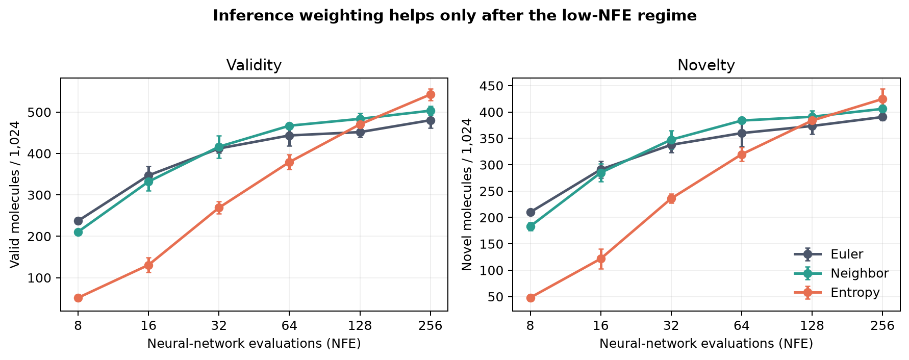

# Context-weighted discrete flow matching: compact QM9 reproduction

[](https://molab.marimo.io/github/alphaXiv/context-weighted-discrete-flow-matching/blob/main/reports/qm9/reproduction.py)

This repository reproduces the central QM9 claims of [*Context-weighted Discrete Flow Matching* (2607.21427)](https://alphaxiv.org/abs/2607.21427): whether revealed local context predicts uncertainty, whether neighbor-weighted inference improves validity and novelty over Euler sampling at matched compute—especially at low model-evaluation counts—and whether scaled cross-entropy improves training.

**Assessment: not reproduced in this compact setup.** The mechanism aligned: at the masking midpoint, predictive entropy fell from 1.062 to 0.283 as visible neighbors increased from zero to four. The interventions diverged:

- The paper reports neighbor-weighted gains up to roughly **2.8× validity / 1.9× novelty**. Here, at NFE 8, the ratios were **0.888× / 0.873×**; the maxima across NFE were **1.071× / 1.066×**.
- The paper reports scaled cross-entropy changing uniform-path validity from **475.4 to 556.0** and novelty from **287.0 to 297.6**. Here, ordinary cross-entropy produced **480.3±18.3 valid / 390.5±6.4 novel**, while the best scaled radius produced **419.3±8.3 / 345.8±10.2**.

The named public QM9 task was used. Substitutions were a 14.4M-parameter masked Transformer instead of the paper’s 92M-parameter model, reconstructed tokenizer/split and scaled-loss weighting because no code or checkpoint was linked, 1,024 generations per condition, and omission of context-weighted path training and OpenWebText.

All experiments ran with the explicit **Kubernetes backend** on **NVIDIA RTX PRO 6000 Blackwell** GPUs. Peak concurrency was **16 GPUs** and measured end-to-end wall time was **30 minutes 45 seconds (0.5125 hours)**.

## Read the evidence

- [Tutorial-style scientific report](reports/qm9/report.md)
- [Self-contained marimo notebook](reports/qm9/reproduction.py)
- [Primary generation records](reports/qm9/results/primary_generation.csv), [diagnostics](reports/qm9/results/primary_diagnostics.csv), [training curves](reports/qm9/results/primary_training.csv), and [robustness records](reports/qm9/results/secondary_generation.csv)
- [Experiment implementation](run_reproduction.py), [configuration](config.json), and [Kubernetes manifest](.orx/k8s.yaml)

The notebook displays the completed evidence and does not require expensive retraining. Run it locally with `marimo edit reports/qm9/reproduction.py` or `marimo run reports/qm9/reproduction.py`.

## Headline result



Neighbor weighting was worse at NFE 8 and 16, crossed Euler around NFE 32, and gave modest improvements from NFE 64 onward. Entropy weighting was especially poor at low NFE but reached the best validity at NFE 256.

## Experiment log

Every formal branch used the exact command shown below. Primary rows contain four independent one-GPU runs; robustness rows contain the stated one-GPU runs.

| Branch / experiment | Purpose or change | Exact run command | Assessment / outcome | Compute |
|---|---|---|---|---|
| `main` | Public report, notebook, figures, and stable implementation | Not run as an experiment (publication surface) | Presentation-only | No experiment |
| [Initial baseline](https://github.com/alphaXiv/context-weighted-discrete-flow-matching/tree/orx/ce-seed-0-baseline) | First Kubernetes manifest check | `python -m pip install --quiet rdkit==2025.3.6 && python run_reproduction.py` | Failed before Python: multiline shell script was passed incorrectly; terminal log recorded `set: pipefail` | 1 GPU, 15 s |
| CE [seed 0](https://github.com/alphaXiv/context-weighted-discrete-flow-matching/tree/orx/ce-seed-0-final), [1](https://github.com/alphaXiv/context-weighted-discrete-flow-matching/tree/orx/ce-seed-1), [2](https://github.com/alphaXiv/context-weighted-discrete-flow-matching/tree/orx/ce-seed-2), [3](https://github.com/alphaXiv/context-weighted-discrete-flow-matching/tree/orx/ce-seed-3) | Ordinary cross-entropy primary control | `python -m pip install --quiet rdkit==2025.3.6 && python run_reproduction.py` | Successful; four-seed matched-NFE sampler comparison | 4 × 1 GPU, 8.9–10.0 min/run |
| SCE radius 1 [seed 0](https://github.com/alphaXiv/context-weighted-discrete-flow-matching/tree/orx/sce-r1-seed-0), [1](https://github.com/alphaXiv/context-weighted-discrete-flow-matching/tree/orx/sce-r1-seed-1), [2](https://github.com/alphaXiv/context-weighted-discrete-flow-matching/tree/orx/sce-r1-seed-2), [3](https://github.com/alphaXiv/context-weighted-discrete-flow-matching/tree/orx/sce-r1-seed-3) | Scaled-loss primary and best radius | `python -m pip install --quiet rdkit==2025.3.6 && python run_reproduction.py` | Successful; below CE on validity and novelty | 4 × 1 GPU, 9.0–9.1 min/run |
| SCE radius 2 [seed 0](https://github.com/alphaXiv/context-weighted-discrete-flow-matching/tree/orx/sce-r2-seed-0), [1](https://github.com/alphaXiv/context-weighted-discrete-flow-matching/tree/orx/sce-r2-seed-1), [2](https://github.com/alphaXiv/context-weighted-discrete-flow-matching/tree/orx/sce-r2-seed-2), [3](https://github.com/alphaXiv/context-weighted-discrete-flow-matching/tree/orx/sce-r2-seed-3) | Radius ablation | `python -m pip install --quiet rdkit==2025.3.6 && python run_reproduction.py` | Successful; lowest scaled condition | 4 × 1 GPU, 9.0–9.7 min/run |
| SCE radius 3 [seed 0](https://github.com/alphaXiv/context-weighted-discrete-flow-matching/tree/orx/sce-r3-seed-0), [1](https://github.com/alphaXiv/context-weighted-discrete-flow-matching/tree/orx/sce-r3-seed-1), [2](https://github.com/alphaXiv/context-weighted-discrete-flow-matching/tree/orx/sce-r3-seed-2), [3](https://github.com/alphaXiv/context-weighted-discrete-flow-matching/tree/orx/sce-r3-seed-3) | Radius ablation | `python -m pip install --quiet rdkit==2025.3.6 && python run_reproduction.py` | Successful; below radius 1 and CE | 4 × 1 GPU, 9.7 min/run |
| [Temperature 0.8](https://github.com/alphaXiv/context-weighted-discrete-flow-matching/tree/orx/temp-0-8), [0.9](https://github.com/alphaXiv/context-weighted-discrete-flow-matching/tree/orx/temp-0-9), [1.1](https://github.com/alphaXiv/context-weighted-discrete-flow-matching/tree/orx/temp-1-1); [scale 2](https://github.com/alphaXiv/context-weighted-discrete-flow-matching/tree/orx/neighbor-scale-2), [scale 6](https://github.com/alphaXiv/context-weighted-discrete-flow-matching/tree/orx/neighbor-scale-6) | Single-seed sampler robustness | `python -m pip install --quiet rdkit==2025.3.6 && python run_reproduction.py` | Successful; low-NFE divergence persisted | 5 × 1 GPU, 8.9–9.4 min/run |
| CE temperature 0.8 [seeds 1–3](https://github.com/alphaXiv/context-weighted-discrete-flow-matching/tree/orx/ce-seed-1-temperature-0-8), CE temperature 1.2 [seeds 0–3](https://github.com/alphaXiv/context-weighted-discrete-flow-matching/tree/orx/ce-seed-0-temperature-1-2), SCE radius 1 temperature 0.8 [seeds 0–3](https://github.com/alphaXiv/context-weighted-discrete-flow-matching/tree/orx/sce-r1-seed-0-temperature-0-8) | Multi-seed temperature robustness | `python -m pip install --quiet rdkit==2025.3.6 && python run_reproduction.py` | Successful; sampling result persisted and SCE remained below CE | 11 × 1 GPU, 8.9–9.1 min/run |

## Reproduce

The formal command is:

```bash
python -m pip install --quiet rdkit==2025.3.6 && python run_reproduction.py
```

`config.json` defines the seed, objective, radius, architecture, and sampler settings. Formal evidence was produced with `orx exp run --backend k8s`; the manifest requests one GPU per run so independent seeds and ablations can run concurrently.
