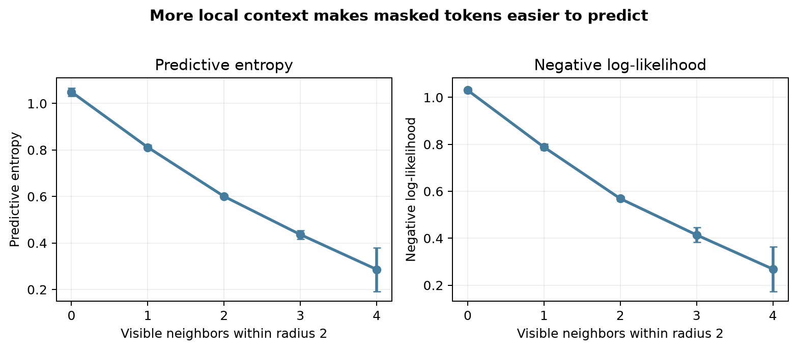
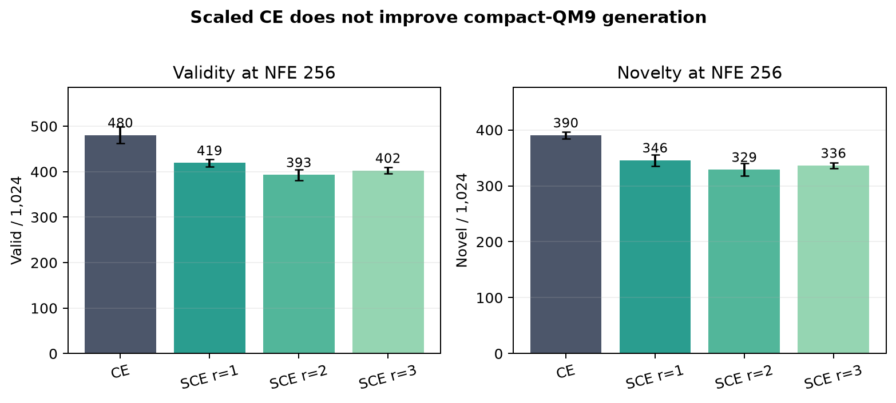
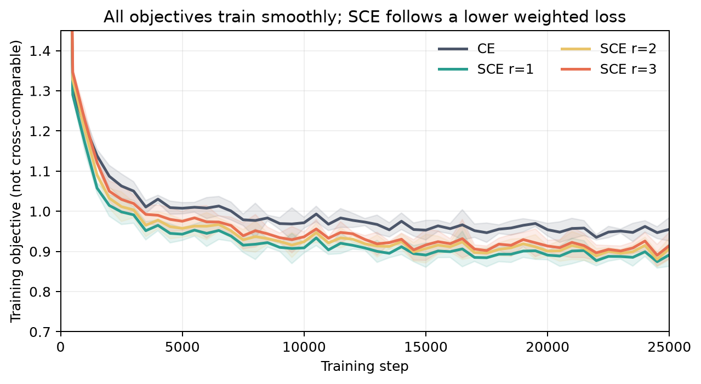
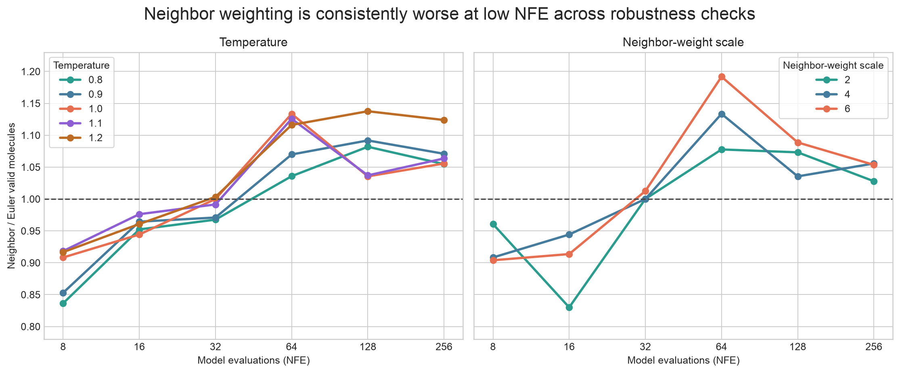

# Context-weighted discrete flow matching on QM9

Molecular generators must decide which missing symbols to reveal first while keeping the finished string chemically meaningful. The paper’s core idea is intuitive: a hidden symbol surrounded by revealed neighbors should be easier to predict, so generation should spend its next update there. We tested whether that idea improves validity and novelty on public QM9 molecules.

## Verdict

**Not reproduced in this compact setup.** The proposed mechanism was clear—more revealed local context reduced uncertainty—but neighbor-weighted sampling helped only from 32–64 model evaluations onward and hurt at the lowest compute. A scaled-loss surrogate also generated fewer valid and novel molecules than ordinary cross-entropy at every tested radius.

Scope: four seeds per loss, 1,024 samples per sampler and compute level, plus temperature and neighbor-scale checks. This is a 14.4M-parameter substitution for the paper’s 92M-parameter model.

**How to read this figure.** Each point is a four-seed mean and each band is one sample standard deviation; higher is better. At 8 evaluations, neighbor weighting produced 211 valid and 183 novel molecules versus Euler’s 237 and 210. It crossed above Euler only at higher compute, reaching at most 1.071× validity and 1.066× novelty—not the paper’s reported gains of up to roughly 2.8× and 1.9×.

The [self-contained notebook](reproduction.py) exposes the compact tables and interpretation; the [raw result records](results/primary_generation.csv) contain every primary generation measurement.

## What was implemented

We downloaded the public QM9 SDF from DeepChem, removed explicit hydrogens, converted each molecule to canonical isomeric SMILES with RDKit, and excluded strings longer than 30 tokens. A bidirectional masked Transformer learned to reconstruct independently hidden tokens along the paper’s quadratic reveal schedule.

The matched-compute samplers made the same number of model calls. Euler revealed each masked position independently. Neighbor weighting drew the same number of updates but prioritized positions with visible radius-one neighbors; entropy weighting prioritized confident positions. For training, ordinary cross-entropy was compared with a local-count softmax reweighting surrogate for scaled cross-entropy at radii 1, 2, and 3. This surrogate, architecture, tokenizer, and split are substitutions because no paper code or checkpoint was linked.

## Local context predicts uncertainty

At halfway through the masking path, mean predictive entropy fell monotonically from 1.062 with no visible neighbors to 0.283 with four; token negative log-likelihood fell from 1.044 to 0.267. This aligned with the paper’s causal motivation and was stable across all 16 primary models. The missing step is benefit: choosing these locally easier sites did not improve the lowest-compute samples.

## Scaled training moved in the opposite direction

At 256 Euler evaluations, ordinary cross-entropy produced 480.3±18.3 valid and 390.5±6.4 novel molecules. The best scaled condition, radius 1, produced 419.3±8.3 valid (−12.7%) and 345.8±10.2 novel (−11.5%); radii 2 and 3 were lower still. The paper’s uniform-path comparison instead increased validity from 475.4 to 556.0 (+17.0%) and novelty from 287.0 to 297.6 (+3.7%). Absolute novelty is not comparable across tokenization and split choices, so the within-setup direction is the decisive comparison.

Every objective trained smoothly for 25,000 steps. The scaled curves are their own weighted objectives and therefore cannot be compared numerically with cross-entropy; the plot rules out gross optimization collapse, not a subtler objective mismatch.

## Robustness of the sampling result

Changing sampling temperature from 0.8 to 1.2 or the neighbor scale from 2 to 6 did not rescue the low-compute claim: every single-seed setting reduced validity at 8 and 16 evaluations. Four-seed temperature repeats agreed at NFE 8; temperature 1.2 was neutral at NFE 16 (1.002×). The checks consistently showed a modest benefit near 64–256 evaluations, peaking at 1.192× validity for scale 6 at 64 evaluations in the single-seed ablation. Lowering temperature also left the training comparison unchanged: at temperature 0.8, radius-one scaled training remained below ordinary cross-entropy by 11.9% validity and 11.6% novelty at 256 Euler evaluations.

## Claim-by-claim assessment

| Claim | Paper evidence | Observed evidence | Assessment |
|---|---:|---:|---|
| Revealed neighbors reduce uncertainty | Local context predicts confidence | Entropy 1.062→0.283; NLL 1.044→0.267 | **Aligned** |
| Neighbor updates improve validity/novelty, especially at low NFE | Up to ~2.8× / ~1.9× over Euler | At NFE 8: 0.888× / 0.873×; maximum 1.071× / 1.066× | **Not aligned under this setup** |
| Scaled cross-entropy improves generation | Validity +17.0%; novelty +3.7% | Best radius: validity −12.7%; novelty −11.5% | **Not aligned under this setup** |
| Radius isolates local context | Radius ablations support local weighting | r1 > r3 > r2, but all < ordinary CE | **Inconclusive under this surrogate** |
| Context-weighted path training and OpenWebText gains | Reported in paper | Not attempted | **Not attempted** |

## Limits and reproducibility

This is evidence on the named public QM9 task, not a toy proxy, but it cannot adjudicate the full-scale paper result. The reproduction used 14.4M rather than 92M parameters, 110,000 training molecules, a reconstructed scaled loss, and 1,024 generations per condition. SMILES validity and novelty remain sensitive to canonicalization, and context-weighted path training was omitted.

All runs used the Kubernetes backend on NVIDIA RTX PRO 6000 Blackwell GPUs, with 16 GPUs allocated concurrently at peak. The measured end-to-end wall time was **30 minutes 45 seconds (0.5125 hours)**; successful primary runs took 8.9–10.0 minutes each and printed nonempty terminal evidence. The exact environment, implementation, data tables, and runnable command are published in this repository.
