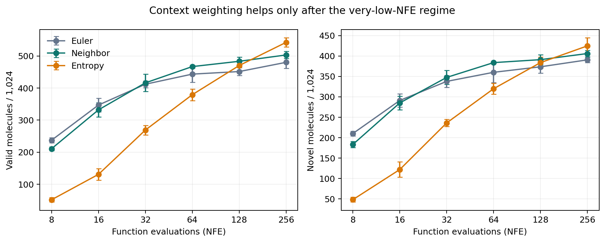
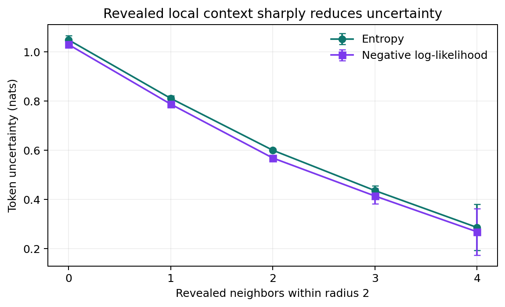
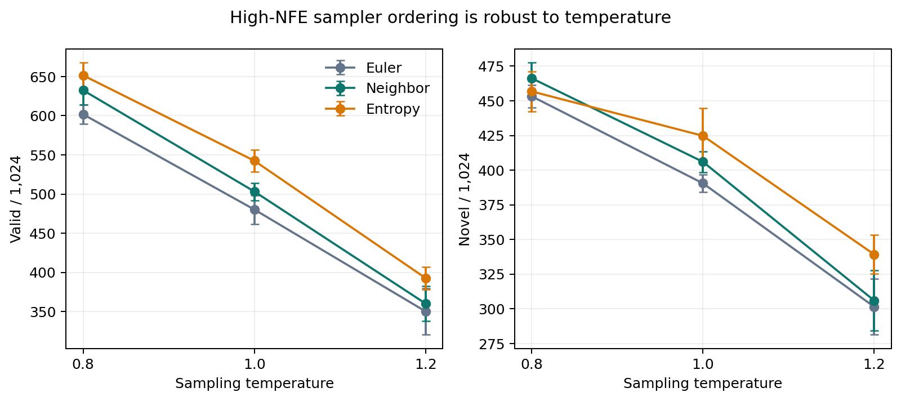

# When local context helps molecular discrete flow matching

Generating a molecule as a text string is difficult because an early wrong symbol can make the whole structure chemically invalid. The paper’s core idea is simple: reveal positions that already have useful nearby context first, and give those better-conditioned positions more weight during training. This reproduction tests whether that idea improves valid and new QM9 molecules when the model and sampling budget are held fixed.

**Verdict — partially reproduced.** Neighbor-weighted sampling improved the compact CE model at moderate and high compute, and local revealed context strongly predicted lower uncertainty. It did not help at NFE 8–16, and scaled cross-entropy (SCE) reduced generation quality for every tested radius.

**Scope.** Canonical QM9 SMILES, masked source, four seeds per CE/SCE-radius condition, and 1,024 generations per sampler/NFE/seed. The architecture is a 14.4M-parameter substitute for the paper’s 92M model.

**How to read this figure.** Higher is better; points are means and error bars are seed standard deviations. Neighbor weighting crosses Euler between NFE 32 and 64, then remains better. Entropy weighting is poor at low NFE but strongest at 256. The requested “especially at low NFE” effect is therefore not present in this setup.

## Claims and observed evidence

| Claim | Paper result | Observed result | Assessment |
|---|---:|---:|---|
| Neighbor-weighted sampling improves molecular validity/novelty | Up to 2.8× valid, 1.9× novel over Euler | At NFE 128: 483.5 vs 451.5 valid; 391.0 vs 373.5 novel (1.07×, 1.05×) | Aligned at NFE 64–256; divergent at 8–16 |
| Local context is a proxy for uncertainty | Entropy and NLL fall with more revealed neighbors | At time 0.5, entropy falls 1.05→0.29 nats from 0→4 neighbors | Aligned |
| SCE improves generation over uniform conditional matching | Mask source: 134.8→177.2 valid; 114.8→137.8 novel | Best SCE radius: 480.2→419.2 valid; 390.5→345.8 novel at NFE 256 | Not observed in this compact setup |
| Radius isolates local-context sensitivity | Moderate neighborhoods offer the best trade-off | r=1 is best among SCE radii; all are below CE | Radius ordering partly aligned; headline gain absent |

## What was implemented

The run path is deliberately small and inspectable. `load_qm9` downloads the public DeepChem QM9 SDF, RDKit canonicalizes isomeric SMILES, and the tokenizer retains sequences fitting the paper’s length 32. A bidirectional transformer predicts clean tokens from a partially masked state sampled with the paper’s quadratic schedule. The model trains for the paper’s 25k QM9 steps with AdamW.

At inference, Euler reveals each masked coordinate independently. Neighbor weighting samples the same expected number of reveals but prioritizes positions by visible tokens within radius 1; entropy weighting prioritizes low-entropy predictions. SCE multiplies masked-token cross-entropy by normalized local-context weights. The fixed run command evaluates all three samplers at NFE 8, 16, 32, 64, 128, and 256.

Key substitutions are 14.4M rather than 92M parameters, batch 512 rather than 2,048, 110k training molecules, and 1,024 samples per seed rather than 5,120 samples split into five folds. These choices preserve the public benchmark and outcome metrics but prevent a numerical replication of the paper.

## The mechanism is present

Across four CE seeds, both predictive entropy and negative log-likelihood decrease monotonically as local revealed context increases. At time 0.5, entropy drops from 1.05 nats with no revealed neighbors to 0.29 with four. This supports the paper’s proposed causal proxy even though not every intervention transfers.

## Sampling helps after enough updates

Neighbor weighting is consistently worse at NFE 8 (−26.5 valid, −26.8 novel) and 16 (−15.0, −6.0), approximately tied at 32, and better at 64–256. At NFE 128 its paired mean gains are +32.0 valid and +17.5 novel; at 256 they are +23.0 and +15.5. Entropy weighting overtakes both at 256 but is dramatically worse below 64.

This crossover matches the paper’s own explanation that too few updates can create local inconsistencies, but not the reproduction target’s stronger low-NFE wording.

## SCE does not transfer

With Euler at NFE 256, CE yields 480.2±18.3 valid and 390.5±6.4 novel molecules. SCE r=1—the best tested radius—yields 419.2±8.3 and 345.8±10.2; r=2 is lowest, and r=3 is intermediate. The stable ordering across four seeds makes this more than a noisy tie, but it applies only to this smaller architecture and preprocessing substitution.

## Robustness and efficiency

Lower temperature raises absolute validity. At temperature 0.8 and NFE 256, neighbor remains above Euler (632.5 vs 601.8 valid); at temperature 1.2 it is 360.2 vs 350.2. Changing neighbor scale from 2 to 6 on seed 0 gives 480–492 valid molecules versus 467 for Euler, so the high-NFE result is not a single-scale artifact.

All formal experiments used Kubernetes on NVIDIA RTX PRO 6000 Blackwell GPUs. Runs used one GPU each, peak concurrency was 16 GPUs, and actual elapsed wall time was 0.51 hours from first launch to final robustness completion; a successful run averaged 0.145 hours and peaked at 2.48 GB allocated GPU memory.

## Reproducibility and limits

The clean evidence is in [factorial_results.csv](data/factorial_results.csv), [robustness_results.csv](data/robustness_results.csv), and the [self-contained notebook](../../notebooks/qm9_reproduction.py). The [CE reference branch](https://github.com/alphaXiv/context-weighted-discrete-flow-matching/tree/orx/ce-seed-0-final), [SCE r=1 branch](https://github.com/alphaXiv/context-weighted-discrete-flow-matching/tree/orx/sce-r1-seed-0), and [temperature branch](https://github.com/alphaXiv/context-weighted-discrete-flow-matching/tree/orx/temp-0-8) expose the important lineage. Setup-only failed and cancelled branches are excluded from measurements.

This is QM9-only evidence: it cannot establish the paper’s OpenWebText results. No author code or checkpoints were available, the vocabulary and split are substitutions, and context-weighted train-time path sampling was omitted to protect the two core tests.

Molab: https://molab.marimo.io/github/alphaXiv/context-weighted-discrete-flow-matching/blob/main/notebooks/qm9_reproduction.py
